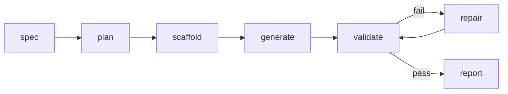

# Agentic App Generator

CLI agent that reads a natural-language spec and generates a working React +
TypeScript app into the provided boilerplate: it plans, generates file by
file, validates, and repairs its own errors.

## Running it

```bash
cp .env.example .env        # add your API key (any OpenAI-compatible provider)

cd agent
npm install
npm run agent -- --spec ../specs/sample-spec.md --output ../my-app

cd ../my-app
npm install && npm run dev  # localhost:5173
```

`generated-app/` is a committed run you can inspect or run directly.
Agent unit tests: `cd agent && npm test`.

Useful flags/env: `--resume` (re-validate and repair an existing output
without regenerating), `LLM_MAX_OUTPUT_TOKENS`, `LLM_TIMEOUT_MS`,
`AGENT_MAX_LLM_CALLS` (hard cost cap), `AGENT_REPAIR_HINT` (append a hint to
the repair prompt when a loop is stuck). All documented in `.env.example`.

## How it works



- **Plan** — one LLM call returns a JSON task list (`{id, file, action,
  description, dependsOn}`). It gets schema-validated (paths restricted to
  `src/` plus a small allowlist), dependency refs normalized, and
  topo-sorted. Invalid plans get one retry with the rejection reason.
- **Scaffold** — copies `boilerplate/` into the output dir. No LLM.
- **Generate** — one call per task in dependency order. Each prompt carries
  the spec, a small curated slice of boilerplate context, the plan manifest,
  and the task's dependency files read from disk. Never the whole repo.
- **Validate** — runs the generated app's own `npm run typecheck` and
  `npm run test`.
- **Repair** — on failure the model gets four tools (`read_file`,
  `write_file`, `run_typecheck`, `run_tests`) and drives the debugging
  itself. Bounded: 3 rounds, 10 tool turns each, old tool results compressed
  out of context. Models that can't do tool calls fall back to regenerating
  the failing files whole.

Generation is a deterministic pipeline on purpose — cost and behavior stay
predictable on a spec I've never seen. Repair is a real tool-calling loop
because debugging needs judgment. That split is the main design decision.

## Design decisions

- **No agent framework.** The loop is what's being evaluated, so I wrote it.
  Agent deps: `tsx` and `typescript`. The LLM client is ~150 lines of
  `fetch`.
- **Provider-agnostic.** One OpenAI-compatible client; `LLM_BASE_URL` +
  `LLM_API_KEY` + `LLM_MODEL` pick the provider (Anthropic, Groq, OpenAI,
  Gemini, OpenRouter all work).
- **Nothing app-specific in prompts.** All product knowledge comes from the
  spec file. Prompts do encode stack traps that reliably break generated
  code: unused imports under `noUnusedLocals`, this MUI version's Grid API,
  JSX needing `.tsx`.
- **Two path-safety layers.** Plan-time allowlist plus a filesystem jail
  (`resolveSafe`) on every model-supplied path, including repair tool
  writes. Repair can't touch `package.json` or tsconfig — weak models try
  to "fix" tests by weakening the toolchain.
- **Everything bounded.** Call cap, repair rounds, tool turns, output
  budgets, truncated tool results. Failed runs still print the cost report.

Free-tier testing (Groq, OpenRouter) shaped a lot of the client: adaptive
output budgets for per-minute token caps, `Retry-After` support, recovery
from killed response streams, a fallback when a provider can't parse the
model's tool-call syntax.

## Models and cost

Developed and stress-tested on free tiers (Llama 3.3 70B, gpt-oss-120b/20b,
Qwen, Nemotron). Consistent result: free models generate fine but can't
converge in repair — model quality matters most at debugging, not writing.

The committed sample: `claude-sonnet-5` for generation (17 files, typecheck
green and 24/28 tests on the first pass), then repair sessions to 28/28.

| | Generation run | Total incl. repair |
|---|---|---|
| LLM calls | 48 | 182 |
| Tokens | 298K in / 28K out | 1.32M in / 81K out |
| Cost | $1.32 | $4.92 |

The repair tail was mostly one bug class: the generated tests contradicted
each other (one asserted a contiguous card title, another asserted split
elements). My guardrail forbade weakening assertions, which deadlocked the
loop until I let it reconcile genuinely contradictory expectations. A clean
run without that tail lands around $1.50-2 on Sonnet.

## What I'd improve

- Cross-test consistency check at plan time — the planner sees all test
  tasks and could pin one rendering contract, which would have prevented
  the contradiction above.
- Parallel generation of independent tasks; prompt caching for the repeated
  context block.
- A reviewer pass (second model) between generate and validate.

## Assumptions

- The PDF and the boilerplate README disagree on which features are
  required (3 vs all 7); the sample spec covers all of them.
- Anthropic is reached through its OpenAI-compatible endpoint; providers
  only need chat completions (tool calls optional — there's a fallback).
- macOS/Linux; no real backend, auth, or CI/CD (out of scope per the
  challenge).

## Layout

```
agent/           the CLI agent
boilerplate/     provided boilerplate + a small MUI theme-token system
specs/           sample spec (agent input)
generated-app/   committed sample output
docs/            design doc + implementation plan
```
