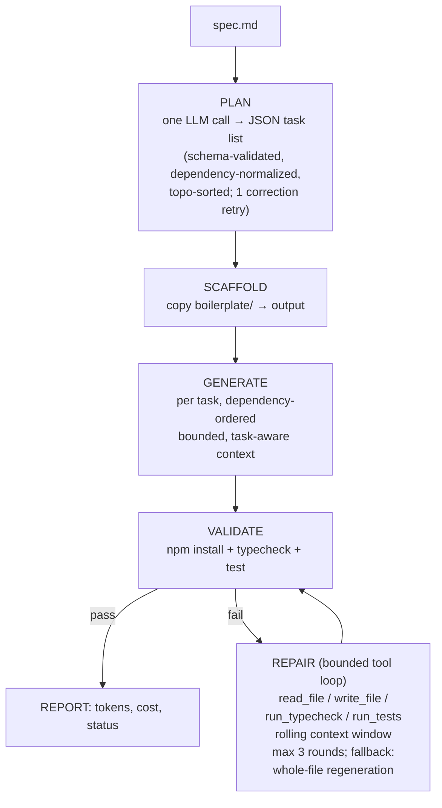

# Agentic App Generator

A CLI agent that reads a natural-language product spec and autonomously
generates a working React + TypeScript app into the provided boilerplate —
planning, generating file-by-file, self-validating, and repairing its own
errors.

Built for the Senior Fullstack Engineer take-home (Agentic Code Generation
Workflow).

## Quick start

```bash
# 1. Configure a provider (any OpenAI-compatible API)
cp .env.example .env   # add your key

# 2. Install + run the agent
cd agent && npm install
npm run agent -- --spec ../specs/sample-spec.md --output ../my-generated-app

# 3. Run the generated app
cd ../my-generated-app && npm install && npm run dev   # localhost:5173
```

`generated-app/` is a committed sample of a verified run. The agent's own
test suite: `cd agent && npm test` (54 tests) and `npm run typecheck`.

## Architecture



**Hybrid design.** Planning and generation are a deterministic pipeline
(predictable cost and shape even on a modified spec); repair is a genuine
LLM tool-calling loop — the model reads errors, inspects files, patches
them, and re-runs checks itself. Models that can't produce valid tool calls
degrade gracefully to whole-file regeneration, so the agent completes on
weak free-tier models and shines on strong ones.

**Context management.** Each generation call receives only: the spec, a
curated task-aware context pack (types + GraphQL operations always; theme +
component exemplar for source tasks; test exemplar for test tasks), a
`<plan>` manifest of every task (so each file knows the whole contract
surface), and the files its task declares as dependencies. The repair loop
keeps only the two most recent tool results in full — older ones compress
to stubs the model can re-read on demand. No full-repo dumps anywhere.

**Anti-memorization.** The prompts contain zero app-domain knowledge —
every product detail comes from the spec file, so a modified spec
generalizes. (Verified by grep: no domain terms in `agent/src/prompts.ts`.)

## Design decisions & tradeoffs

- **Provider-agnostic LLM layer** — one raw-`fetch` client speaking the
  OpenAI-compatible chat completions format; `LLM_BASE_URL` /
  `LLM_API_KEY` / `LLM_MODEL` select the provider (Anthropic via its
  compat endpoint, Groq, OpenAI, Gemini, OpenRouter). Tradeoff: foregoes
  provider-native extras (e.g. Anthropic prompt caching) so evaluators can
  run it with whatever key they have.
- **No agent framework, almost no dependencies** — the loop *is* the
  deliverable. The agent's only packages are `tsx` and `typescript` (dev);
  the LLM client, .env parser, and retry logic are hand-rolled and unit
  tested (54 tests, TDD for every pure module).
- **Two-layer path safety** — plan-time validation (writable allowlist:
  `src/` + four root files, no traversal/control chars) and filesystem-time
  confinement (`resolveSafe`) on every model-supplied path, including
  repair-tool writes. The repair loop cannot touch `package.json` even if
  prompted to.
- **Bounded everything** — global LLM-call cap, 3 repair rounds, 10 tool
  turns, adaptive output budgets, truncated tool results: a run cannot run
  away on cost, and every abort path still prints the cost report.

## Free-tier resilience (discovered the hard way)

The committed sample was generated entirely on Groq's free tier, which
surfaced real-world provider behaviors that are now permanent features:

| Provider behavior | Agent response |
|---|---|
| Requests rejected when prompt + output budget exceeds a per-minute cap (HTTP 413) | Output budget auto-halves (16000 → … → 2000 floor) with a pause between retries; task-aware prompt trimming keeps requests small |
| `tool_use_failed` 400s when a model emits malformed tool syntax | Retry once, then treat the model as tools-incapable and switch the repair round to whole-file regeneration |
| Planner emits file paths instead of task ids in `dependsOn` | Normalize: map paths to the producing task (preserving order), keep boilerplate paths as context, reject only junk |
| Reasoning models spend hidden thinking tokens from the output budget | Optional `LLM_REASONING_EFFORT=low` knob |
| `Retry-After` headers on 429s | Honored (capped at 60s), else exponential backoff |
| Repair conversations outgrow tight per-minute windows | Rolling tool-result window; graceful hand-off to regeneration when even that cannot fit |

## Which LLM(s) and why

Developed provider-agnostic; exercised end-to-end on Groq's and
OpenRouter's free tiers (`llama-3.3-70b-versatile`, `openai/gpt-oss-120b`,
`openai/gpt-oss-20b`, `qwen/qwen3.6-27b`, Nemotron) — chosen deliberately
to prove the agent survives hostile rate limits and weak-model failure
modes at $0 cost. Finding: free models *generate* competently but struggle
to *converge* in repair; model quality bites hardest at debugging.

The committed `generated-app/` was produced by **`claude-sonnet-5`** (full
generation: 17 files, typecheck green + 24/28 tests on the first pass) and
finished to 28/28 via `--resume` repair sessions (sonnet/opus/haiku),
including the operator-hint feature (`AGENT_REPAIR_HINT`) — a
human-in-the-loop steering knob where the operator points at a diagnosis
and the agent still performs all edits itself.

Note on the cost line: the built-in price table covers Anthropic models;
other providers intentionally report `n/a` rather than a wrong guess —
Groq free tier is $0 by definition.

## Cost per run (measured)

| Metric | Full generation run (claude-sonnet-5) | Total incl. repair convergence |
|---|---|---|
| LLM calls | 48 | 182 |
| Tokens | 298K in / 28K out | ~1.32M in / 81K out |
| Estimated cost | $1.32 | $4.92 |
| Repair rounds | 3 | 3 + five `--resume` sessions |

The repair tail was dominated by one genuinely hard case: the generated
test suite contained mutually contradictory expectations (one test asserted
a contiguous card title, another asserted split elements, a third was
polluted by MUI Select's self-referencing `aria-labelledby`). The agent's
anti-cheating guardrail correctly refused to weaken assertions, which
deadlocked repair until the guardrail learned to distinguish contradictions
from legitimate assertions. A typical clean run without such a tail:
~$1.30-2.00 on `claude-sonnet-5`.

## What worked well / what I'd improve

- Worked well: dependency-ordered single-file generation keeps prompts
  small and outputs parseable; schema-validated planning with one
  correction retry converges reliably; the tool-calling repair loop makes
  real, targeted fixes (verified `read_file`→`write_file`→`run_typecheck`
  sequences in run logs); review-driven hardening caught every failure
  class a hostile free tier could produce.
- Hard-won insight: an agent that validates itself with tests it also wrote
  needs a policy for *self-contradictory* tests — "never weaken assertions"
  alone deadlocks against them. The guardrail now distinguishes broken test
  setup and contradictory expectations (fixable) from legitimate assertions
  (untouchable).
- With more time: parallel generation of independent tasks; provider-native
  prompt caching for the repeated context pack; a cross-test consistency
  check at generation time (the planner sees all test tasks — it could be
  asked to define one canonical rendering contract); a second-model
  "reviewer" pass before validation; richer plan schema (per-task
  acceptance criteria). `--resume` and operator hints started as
  future-work items and were built mid-project when free-tier quota deaths
  made them necessary.

## Assumptions

- The challenge PDF marks 3 features required and the repo README marks all
  7 required (their deadlines also differ); the sample spec covers all of
  them, so either reading is satisfied.
- Anthropic is reachable via its OpenAI-compatible endpoint; providers need
  chat completions only (tool calls optional — there is a fallback path).
- No real backend, auth, or CI/CD (explicitly out of scope).
- macOS/Linux evaluators (spawned `npm` without a shell).

## Repo layout

```
agent/           the CLI agent (TypeScript; deps: tsx + typescript only)
boilerplate/     provided boilerplate + theme.ts design-token system
specs/           sample natural-language spec (the agent's input)
generated-app/   committed sample output of a verified run
docs/            design spec + implementation plan (process artifacts)
```

The git history tells the story: design doc → plan → boilerplate → each
module TDD'd with two-stage review → E2E hardening discovered on real
free-tier runs → verified sample.
