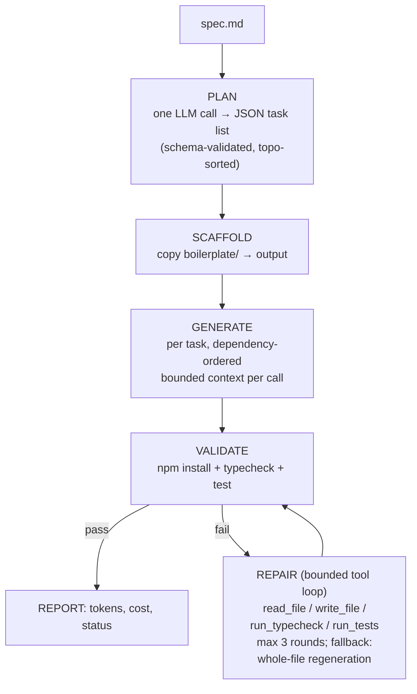

# Agentic App Generator Implementation Plan

> **For agentic workers:** REQUIRED SUB-SKILL: Use superpowers:subagent-driven-development (recommended) or superpowers:executing-plans to implement this plan task-by-task. Steps use checkbox (`- [ ]`) syntax for tracking.

**Goal:** A provider-agnostic TypeScript CLI agent that reads a natural-language spec and autonomously generates a working React app into the provided boilerplate, self-validating and repairing via a bounded tool-calling loop.

**Architecture:** Hybrid pipeline — deterministic phases (Plan → Scaffold → Generate → Validate) plus an LLM tool-calling Repair loop with a whole-file-regeneration fallback. One raw-`fetch` LLM client speaking the OpenAI-compatible chat completions format (works with Anthropic, Groq, OpenAI, Gemini, OpenRouter).

**Tech Stack:** TypeScript, Node 22+, `tsx` (only dependency), `node:test` for agent unit tests. Generated app: React 19 + Apollo + MUI + MSW + Vitest (pre-configured boilerplate).

**Amendments (2026-08-12, from per-task code review):** Tasks 5-7 gained robustness fixes and regression tests beyond the blocks below — extract.ts handles info-string/unclosed/empty fences and multi-fence JSON (12 tests); toposort pins unknown-id behavior (4 tests); plan-schema rejects directory/whitespace paths and explains rejections via ALLOWED_HINT (8 tests). Task 9's config gained export-prefix/inline-comment/BOM parsing and a validated call cap (6 tests). Task 11's llm.ts was reworked for provider resilience (error-shaped 200s, Retry-After, timeouts, truncation detection, message normalization, OpenAI max_tokens fallback) with extracted pure functions (5 tests). Task 12's prompts gained typecheck-trap rules (TS6133, MUI v6 Grid, .tsx-for-JSX, provider duplication), a `<plan>` manifest + `<current_file>` section in generatePrompt (now also taking allTasks), repair guardrails (no package.json edits, no test weakening), and handlers.ts in the planner's context. The git history records each amendment; the blocks below reflect the original plan where superseded.

**Paths:** Repo root is `/Users/jhojangarcia/Documents/BIMM Senior FullStack Agentic AI Challenge/agentic-app-generator/`. The provided boilerplate source is `/Users/jhojangarcia/Documents/BIMM Senior FullStack Agentic AI Challenge/Fullstack-Coding-Challenge-main/`. All `git` and `npm` commands run from repo root unless stated. Git identity is already configured (jhojanestiven1996@gmail.com).

---

### Task 1: Repo scaffolding

**Files:**
- Create: `.gitignore`

- [ ] **Step 1: Write `.gitignore`**

```gitignore
node_modules/
dist/
.env
*.log
.DS_Store
```

- [ ] **Step 2: Commit**

```bash
git add .gitignore
git commit -m "chore: add root gitignore"
```

---

### Task 2: Import the provided boilerplate

**Files:**
- Create: `boilerplate/` (copied from the provided challenge folder)

- [ ] **Step 1: Copy the boilerplate (excluding node_modules/.git)**

```bash
mkdir -p boilerplate
rsync -a --exclude node_modules --exclude .git \
  "/Users/jhojangarcia/Documents/BIMM Senior FullStack Agentic AI Challenge/Fullstack-Coding-Challenge-main/" boilerplate/
```

- [ ] **Step 2: Verify the boilerplate works untouched**

```bash
cd boilerplate && npm install && npm run typecheck && npm run test
```

Expected: typecheck passes, 2 tests pass ("Example component").

- [ ] **Step 3: Commit**

```bash
git add boilerplate
git commit -m "chore: import provided car-inventory boilerplate"
```

---

### Task 3: Mini design system (MUI theme tokens)

**Files:**
- Create: `boilerplate/src/theme.ts`
- Modify: `boilerplate/src/main.tsx` (replace inline theme)

- [ ] **Step 1: Create `boilerplate/src/theme.ts`**

```typescript
import { createTheme } from "@mui/material";

/**
 * Mini design system: design tokens + MUI component overrides.
 * Generated components must consume these tokens (via the theme /
 * sx prop) instead of hardcoding colors or radii.
 */
export const tokens = {
  color: {
    primary: "#0F766E",
    primaryDark: "#115E59",
    accent: "#B45309",
    background: "#F8FAFC",
    surface: "#FFFFFF",
    textPrimary: "#0F172A",
    textSecondary: "#475569",
  },
  radius: { sm: 6, md: 10, lg: 16 },
} as const;

export const theme = createTheme({
  palette: {
    mode: "light",
    primary: { main: tokens.color.primary, dark: tokens.color.primaryDark },
    secondary: { main: tokens.color.accent },
    background: { default: tokens.color.background, paper: tokens.color.surface },
    text: { primary: tokens.color.textPrimary, secondary: tokens.color.textSecondary },
  },
  typography: {
    fontFamily:
      '-apple-system, BlinkMacSystemFont, "Segoe UI", Roboto, "Helvetica Neue", Arial, sans-serif',
    h3: { fontWeight: 700, letterSpacing: "-0.02em" },
    h6: { fontWeight: 600 },
    button: { textTransform: "none", fontWeight: 600 },
  },
  shape: { borderRadius: tokens.radius.md },
  components: {
    MuiCard: {
      styleOverrides: {
        root: {
          borderRadius: tokens.radius.lg,
          boxShadow: "0 1px 3px rgba(15, 23, 42, 0.08)",
        },
      },
    },
    MuiButton: {
      defaultProps: { disableElevation: true },
      styleOverrides: { root: { borderRadius: tokens.radius.md } },
    },
    MuiTextField: { defaultProps: { size: "small" } },
  },
});
```

- [ ] **Step 2: Wire it into `boilerplate/src/main.tsx`**

Replace the whole file with:

```tsx
import React from "react";
import ReactDOM from "react-dom/client";
import { ApolloProvider } from "@apollo/client";
import { ThemeProvider, CssBaseline } from "@mui/material";
import { client } from "@/graphql/client";
import { theme } from "@/theme";
import App from "@/App";

async function bootstrap() {
  // Start MSW in development
  if (import.meta.env.DEV) {
    const { worker } = await import("@/mocks/browser");
    await worker.start({ onUnhandledRequest: "bypass" });
  }

  ReactDOM.createRoot(document.getElementById("root")!).render(
    <React.StrictMode>
      <ApolloProvider client={client}>
        <ThemeProvider theme={theme}>
          <CssBaseline />
          <App />
        </ThemeProvider>
      </ApolloProvider>
    </React.StrictMode>
  );
}

bootstrap();
```

- [ ] **Step 3: Verify boilerplate still passes**

```bash
cd boilerplate && npm run typecheck && npm run test
```

Expected: PASS (2 tests).

- [ ] **Step 4: Commit**

```bash
git add boilerplate/src/theme.ts boilerplate/src/main.tsx
git commit -m "feat: add MUI theme-token design system to boilerplate"
```

---

### Task 4: Agent package setup

**Files:**
- Create: `agent/package.json`
- Create: `agent/tsconfig.json`

- [ ] **Step 1: Create `agent/package.json`**

```json
{
  "name": "agentic-app-generator",
  "private": true,
  "version": "1.0.0",
  "type": "module",
  "engines": { "node": ">=22" },
  "scripts": {
    "agent": "tsx src/index.ts",
    "test": "node --import tsx --test \"src/**/*.test.ts\"",
    "typecheck": "tsc --noEmit"
  },
  "devDependencies": {
    "@types/node": "^22.10.0",
    "tsx": "^4.19.0",
    "typescript": "~5.7.0"
  }
}
```

- [ ] **Step 2: Create `agent/tsconfig.json`**

```json
{
  "compilerOptions": {
    "target": "ES2022",
    "module": "ESNext",
    "moduleResolution": "bundler",
    "lib": ["ES2022"],
    "types": ["node"],
    "strict": true,
    "noUncheckedIndexedAccess": true,
    "noUnusedLocals": true,
    "noUnusedParameters": true,
    "isolatedModules": true,
    "moduleDetection": "force",
    "noEmit": true,
    "skipLibCheck": true,
    "esModuleInterop": true
  },
  "include": ["src"]
}
```

- [ ] **Step 3: Install and verify**

```bash
cd agent && npm install && npm run typecheck
```

Expected: install succeeds; typecheck passes (no src files yet is OK — tsc exits 0 on empty include with noEmit... if it errors with "No inputs were found", that is expected and resolved by Task 5; proceed).

- [ ] **Step 4: Commit**

```bash
git add agent/package.json agent/package-lock.json agent/tsconfig.json
git commit -m "chore: scaffold agent package (tsx + typescript only)"
```

---

### Task 5: Agent domain types + LLM-output extraction utils (TDD)

**Files:**
- Create: `agent/src/types.ts`
- Create: `agent/src/lib/extract.ts`
- Test: `agent/src/lib/extract.test.ts`

- [ ] **Step 1: Create `agent/src/types.ts`**

```typescript
export interface PlanTask {
  id: string;
  file: string;
  action: "create" | "modify";
  description: string;
  dependsOn: string[];
}

export interface AgentConfig {
  baseUrl: string;
  apiKey: string;
  model: string;
  maxLlmCalls: number;
  specPath: string;
  outputDir: string;
  boilerplateDir: string;
}
```

- [ ] **Step 2: Write the failing tests — `agent/src/lib/extract.test.ts`**

```typescript
import { test } from "node:test";
import assert from "node:assert/strict";
import { extractJson, extractCodeBlock } from "./extract";

test("extractJson parses raw JSON", () => {
  assert.deepEqual(extractJson('[{"a":1}]'), [{ a: 1 }]);
});

test("extractJson parses a ```json fence surrounded by prose", () => {
  const text = 'Here is the plan:\n```json\n[{"id":"t1"}]\n```\nDone.';
  assert.deepEqual(extractJson(text), [{ id: "t1" }]);
});

test("extractJson recovers a bare array embedded in prose", () => {
  assert.deepEqual(extractJson("Sure! [1, 2, 3] — that is all."), [1, 2, 3]);
});

test("extractJson throws on garbage", () => {
  assert.throws(() => extractJson("no json here"), /no parseable JSON/);
});

test("extractCodeBlock takes the largest fenced block", () => {
  const text =
    "```ts\nconst a = 1;\n```\nand\n```tsx\nexport default function App() { return null; }\n```";
  assert.match(extractCodeBlock(text), /export default function App/);
});

test("extractCodeBlock falls back to raw text when no fence exists", () => {
  assert.equal(extractCodeBlock("export const x = 1;"), "export const x = 1;\n");
});

test("extractCodeBlock throws on empty response", () => {
  assert.throws(() => extractCodeBlock("   "), /no code/);
});
```

- [ ] **Step 3: Run tests to verify they fail**

```bash
cd agent && npm test
```

Expected: FAIL — cannot find module `./extract`.

- [ ] **Step 4: Implement `agent/src/lib/extract.ts`**

```typescript
/** Parse JSON out of an LLM response: raw, fenced, or embedded in prose. */
export function extractJson(text: string): unknown {
  try {
    return JSON.parse(text);
  } catch {
    /* fall through */
  }
  const fence = text.match(/```(?:json)?\s*\n([\s\S]*?)```/);
  if (fence?.[1]) {
    try {
      return JSON.parse(fence[1]);
    } catch {
      /* fall through */
    }
  }
  for (const [open, close] of [
    ["[", "]"],
    ["{", "}"],
  ] as const) {
    const start = text.indexOf(open);
    const end = text.lastIndexOf(close);
    if (start !== -1 && end > start) {
      try {
        return JSON.parse(text.slice(start, end + 1));
      } catch {
        /* fall through */
      }
    }
  }
  throw new Error("Response contains no parseable JSON");
}

/** Extract file content from an LLM response: largest fence, else raw text. */
export function extractCodeBlock(text: string): string {
  const fences = [...text.matchAll(/```[a-zA-Z]*\s*\n([\s\S]*?)```/g)].map(
    (m) => m[1] ?? ""
  );
  if (fences.length > 0) {
    return fences.reduce((a, b) => (b.length > a.length ? b : a)).trim() + "\n";
  }
  const trimmed = text.trim();
  if (trimmed.length === 0) throw new Error("Response contains no code");
  return trimmed + "\n";
}
```

- [ ] **Step 5: Run tests to verify they pass**

```bash
cd agent && npm test
```

Expected: PASS (7 tests).

- [ ] **Step 6: Commit**

```bash
git add agent/src/types.ts agent/src/lib/extract.ts agent/src/lib/extract.test.ts
git commit -m "feat: agent types + robust LLM output extraction (TDD)"
```

---

### Task 6: Topological sort (TDD)

**Files:**
- Create: `agent/src/lib/toposort.ts`
- Test: `agent/src/lib/toposort.test.ts`

- [ ] **Step 1: Write the failing tests — `agent/src/lib/toposort.test.ts`**

```typescript
import { test } from "node:test";
import assert from "node:assert/strict";
import { topoSort } from "./toposort";
import type { PlanTask } from "../types";

function task(id: string, dependsOn: string[]): PlanTask {
  return { id, file: `src/${id}.ts`, action: "create", description: id, dependsOn };
}

test("orders dependencies before dependents", () => {
  const sorted = topoSort([task("c", ["b"]), task("a", []), task("b", ["a"])]);
  assert.deepEqual(
    sorted.map((t) => t.id),
    ["a", "b", "c"]
  );
});

test("keeps every task exactly once", () => {
  const sorted = topoSort([task("a", []), task("b", ["a"]), task("c", ["a"])]);
  assert.equal(sorted.length, 3);
  assert.equal(new Set(sorted.map((t) => t.id)).size, 3);
});

test("throws on dependency cycles", () => {
  assert.throws(() => topoSort([task("a", ["b"]), task("b", ["a"])]), /cycle/);
});
```

- [ ] **Step 2: Run tests to verify they fail**

```bash
cd agent && npm test
```

Expected: FAIL — cannot find module `./toposort`.

- [ ] **Step 3: Implement `agent/src/lib/toposort.ts`**

```typescript
import type { PlanTask } from "../types";

/** Depth-first topological sort. Throws on cycles or unknown ids. */
export function topoSort(tasks: PlanTask[]): PlanTask[] {
  const byId = new Map(tasks.map((t) => [t.id, t]));
  const visiting = new Set<string>();
  const done = new Set<string>();
  const ordered: PlanTask[] = [];

  function visit(id: string): void {
    if (done.has(id)) return;
    if (visiting.has(id)) throw new Error(`Dependency cycle involving task "${id}"`);
    visiting.add(id);
    const t = byId.get(id);
    if (!t) throw new Error(`Unknown task id "${id}"`);
    for (const dep of t.dependsOn) visit(dep);
    visiting.delete(id);
    done.add(id);
    ordered.push(t);
  }

  for (const t of tasks) visit(t.id);
  return ordered;
}
```

- [ ] **Step 4: Run tests to verify they pass**

```bash
cd agent && npm test
```

Expected: PASS (10 tests total).

- [ ] **Step 5: Commit**

```bash
git add agent/src/lib/toposort.ts agent/src/lib/toposort.test.ts
git commit -m "feat: dependency-aware task ordering via toposort (TDD)"
```

---

### Task 7: Plan schema validation (TDD)

**Files:**
- Create: `agent/src/plan-schema.ts`
- Test: `agent/src/plan-schema.test.ts`

- [ ] **Step 1: Write the failing tests — `agent/src/plan-schema.test.ts`**

```typescript
import { test } from "node:test";
import assert from "node:assert/strict";
import { validatePlan } from "./plan-schema";

const good = [
  { id: "t1", file: "src/hooks/useThing.ts", action: "create", description: "hook", dependsOn: [] },
  { id: "t2", file: "src/App.tsx", action: "modify", description: "wire up", dependsOn: ["t1"] },
];

test("accepts a valid plan", () => {
  const tasks = validatePlan(good);
  assert.equal(tasks.length, 2);
  assert.equal(tasks[0]?.id, "t1");
});

test("rejects non-arrays", () => {
  assert.throws(() => validatePlan({ tasks: [] }), /array/);
});

test("rejects duplicate ids", () => {
  assert.throws(() => validatePlan([good[0], good[0]]), /Duplicate/);
});

test("rejects paths escaping the project", () => {
  assert.throws(
    () => validatePlan([{ ...good[0], file: "../evil.ts" }]),
    /not writable/
  );
  assert.throws(
    () => validatePlan([{ ...good[0], file: "/etc/passwd" }]),
    /not writable/
  );
});

test("rejects unknown dependency ids", () => {
  assert.throws(
    () => validatePlan([{ ...good[0], dependsOn: ["missing"] }]),
    /unknown task/
  );
});

test("rejects bad actions", () => {
  assert.throws(() => validatePlan([{ ...good[0], action: "delete" }]), /action/);
});

test("rejects directory-shaped and whitespace-padded paths", () => {
  assert.throws(() => validatePlan([{ ...good[0], file: "src/" }]), /not writable/);
  assert.throws(() => validatePlan([{ ...good[0], file: "src/components/" }]), /not writable/);
  assert.throws(() => validatePlan([{ ...good[0], file: "src/App.tsx " }]), /not writable/);
  assert.throws(() => validatePlan([{ ...good[0], file: "src/App.tsx\n" }]), /not writable/);
});

test("allows whitelisted root files and rejects others", () => {
  const rootTask = { ...good[0], file: "index.html" };
  assert.equal(validatePlan([rootTask])[0]?.file, "index.html");
  assert.throws(() => validatePlan([{ ...good[0], file: "package.json" }]), /not writable/);
});
```

- [ ] **Step 2: Run tests to verify they fail**

```bash
cd agent && npm test
```

Expected: FAIL — cannot find module `./plan-schema`.

- [ ] **Step 3: Implement `agent/src/plan-schema.ts`**

```typescript
import type { PlanTask } from "./types";

const ALLOWED_ROOT_FILES = new Set([
  "index.html",
  "vite.config.ts",
  "vitest.config.ts",
  "tsconfig.json",
]);

export function isSafeProjectPath(file: string): boolean {
  if (file.length === 0 || file !== file.trim()) return false; // whitespace/newline padding
  if (file.endsWith("/")) return false; // a directory, not a file
  for (const ch of file) {
    if ((ch.codePointAt(0) ?? 0) < 33) return false; // control chars and spaces
  }
  if (file.includes("..") || file.startsWith("/") || file.includes("\\")) return false;
  return file.startsWith("src/") || ALLOWED_ROOT_FILES.has(file);
}

const ALLOWED_HINT = `paths must start with "src/" or be one of: ${[...ALLOWED_ROOT_FILES].join(", ")}`;

/** Structurally validate the LLM-produced plan. Throws descriptive errors
 *  (the messages are fed back to the model on the retry prompt). */
export function validatePlan(raw: unknown): PlanTask[] {
  if (!Array.isArray(raw)) throw new Error("Plan must be a JSON array of tasks");
  if (raw.length === 0 || raw.length > 30)
    throw new Error(`Plan must contain 1-30 tasks, got ${raw.length}`);

  const ids = new Set<string>();
  const tasks: PlanTask[] = [];
  for (const [i, item] of raw.entries()) {
    if (typeof item !== "object" || item === null)
      throw new Error(`Task ${i} is not an object`);
    const { id, file, action, description, dependsOn } = item as Record<string, unknown>;
    if (typeof id !== "string" || id.length === 0)
      throw new Error(`Task ${i}: "id" must be a non-empty string`);
    if (ids.has(id)) throw new Error(`Duplicate task id "${id}"`);
    ids.add(id);
    if (typeof file !== "string" || !isSafeProjectPath(file))
      throw new Error(
        `Task "${id}": "file" is not writable by this agent — ${ALLOWED_HINT} ` +
          `(got ${JSON.stringify(file).slice(0, 120)})`
      );
    if (action !== "create" && action !== "modify")
      throw new Error(`Task "${id}": "action" must be "create" or "modify"`);
    if (typeof description !== "string" || description.length === 0)
      throw new Error(`Task "${id}": "description" must be a non-empty string`);
    if (!Array.isArray(dependsOn) || dependsOn.some((d) => typeof d !== "string"))
      throw new Error(`Task "${id}": "dependsOn" must be an array of task ids`);
    tasks.push({ id, file, action, description, dependsOn: dependsOn as string[] });
  }
  for (const t of tasks)
    for (const d of t.dependsOn)
      if (!ids.has(d)) throw new Error(`Task "${t.id}" depends on unknown task "${d}"`);
  return tasks;
}
```

- [ ] **Step 4: Run tests to verify they pass**

```bash
cd agent && npm test
```

Expected: PASS (16 tests total).

- [ ] **Step 5: Commit**

```bash
git add agent/src/plan-schema.ts agent/src/plan-schema.test.ts
git commit -m "feat: schema validation for LLM-produced plans (TDD)"
```

---

### Task 8: Path confinement (TDD)

**Files:**
- Create: `agent/src/lib/safe-path.ts`
- Test: `agent/src/lib/safe-path.test.ts`

- [ ] **Step 1: Write the failing tests — `agent/src/lib/safe-path.test.ts`**

```typescript
import { test } from "node:test";
import assert from "node:assert/strict";
import path from "node:path";
import os from "node:os";
import { resolveSafe } from "./safe-path";

const root = path.join(os.tmpdir(), "agent-safe-path-root");

test("resolves paths inside the root", () => {
  const resolved = resolveSafe(root, "src/App.tsx");
  assert.equal(resolved, path.join(root, "src", "App.tsx"));
});

test("rejects .. traversal", () => {
  assert.throws(() => resolveSafe(root, "../outside.txt"), /escapes/);
});

test("rejects absolute paths outside the root", () => {
  assert.throws(() => resolveSafe(root, "/etc/passwd"), /escapes/);
});
```

- [ ] **Step 2: Run tests to verify they fail**

```bash
cd agent && npm test
```

Expected: FAIL — cannot find module `./safe-path`.

- [ ] **Step 3: Implement `agent/src/lib/safe-path.ts`**

```typescript
import path from "node:path";

/** Resolve `relative` inside `root`, refusing any path that escapes it.
 *  Every model-supplied path (plan files, tool calls) goes through this. */
export function resolveSafe(root: string, relative: string): string {
  const rootResolved = path.resolve(root);
  const resolved = path.resolve(rootResolved, relative);
  if (resolved !== rootResolved && !resolved.startsWith(rootResolved + path.sep)) {
    throw new Error(`Path escapes project root: ${relative}`);
  }
  return resolved;
}
```

- [ ] **Step 4: Run tests to verify they pass**

```bash
cd agent && npm test
```

Expected: PASS (19 tests total).

- [ ] **Step 5: Commit**

```bash
git add agent/src/lib/safe-path.ts agent/src/lib/safe-path.test.ts
git commit -m "feat: confine model-supplied paths to the output dir (TDD)"
```

---

### Task 9: Config + .env loading (TDD)

**Files:**
- Create: `agent/src/config.ts`
- Test: `agent/src/config.test.ts`

- [ ] **Step 1: Write the failing tests — `agent/src/config.test.ts`**

```typescript
import { test } from "node:test";
import assert from "node:assert/strict";
import { parseEnvFile } from "./config";

test("parses KEY=value lines and ignores comments/blanks", () => {
  const parsed = parseEnvFile("# comment\n\nA=1\nB = two\n");
  assert.deepEqual(parsed, { A: "1", B: "two" });
});

test("strips matching quotes", () => {
  const parsed = parseEnvFile('A="hello world"\nB=\'x\'\n');
  assert.deepEqual(parsed, { A: "hello world", B: "x" });
});
```

- [ ] **Step 2: Run tests to verify they fail**

```bash
cd agent && npm test
```

Expected: FAIL — cannot find module `./config`.

- [ ] **Step 3: Implement `agent/src/config.ts`**

```typescript
import fs from "node:fs";
import path from "node:path";
import type { AgentConfig } from "./types";

/** Minimal .env parser — avoids a dotenv dependency. */
export function parseEnvFile(content: string): Record<string, string> {
  const out: Record<string, string> = {};
  for (const line of content.split("\n")) {
    const m = line.match(/^\s*([A-Za-z_][A-Za-z0-9_]*)\s*=\s*(.*?)\s*$/);
    if (!m || !m[1]) continue;
    let value = m[2] ?? "";
    if (
      (value.startsWith('"') && value.endsWith('"') && value.length >= 2) ||
      (value.startsWith("'") && value.endsWith("'") && value.length >= 2)
    ) {
      value = value.slice(1, -1);
    }
    out[m[1]] = value;
  }
  return out;
}

/** Load .env files (first match wins; real env vars always win). */
export function loadDotEnv(dirs: string[]): void {
  for (const dir of dirs) {
    const file = path.join(dir, ".env");
    if (!fs.existsSync(file)) continue;
    const parsed = parseEnvFile(fs.readFileSync(file, "utf8"));
    for (const [k, v] of Object.entries(parsed)) {
      if (process.env[k] === undefined) process.env[k] = v;
    }
  }
}

export function buildConfig(
  args: { spec: string; output: string },
  repoRoot: string
): AgentConfig {
  const apiKey = process.env["LLM_API_KEY"] ?? "";
  if (!apiKey) {
    throw new Error(
      "LLM_API_KEY is not set. Copy .env.example to .env and add your provider key."
    );
  }
  return {
    baseUrl: (process.env["LLM_BASE_URL"] ?? "https://api.anthropic.com/v1").replace(/\/+$/, ""),
    apiKey,
    model: process.env["LLM_MODEL"] ?? "claude-opus-5",
    maxLlmCalls: Number(process.env["AGENT_MAX_LLM_CALLS"] ?? 60),
    specPath: path.resolve(args.spec),
    outputDir: path.resolve(args.output),
    boilerplateDir: path.join(repoRoot, "boilerplate"),
  };
}
```

- [ ] **Step 4: Run tests to verify they pass**

```bash
cd agent && npm test
```

Expected: PASS (21 tests total).

- [ ] **Step 5: Commit**

```bash
git add agent/src/config.ts agent/src/config.test.ts
git commit -m "feat: env-based provider config with zero-dep dotenv (TDD)"
```

---

### Task 10: Usage tracking + cost report (TDD)

**Files:**
- Create: `agent/src/report.ts`
- Test: `agent/src/report.test.ts`

- [ ] **Step 1: Write the failing tests — `agent/src/report.test.ts`**

```typescript
import { test } from "node:test";
import assert from "node:assert/strict";
import { UsageTracker } from "./report";

test("accumulates tokens and call count", () => {
  const t = new UsageTracker();
  t.add(100, 50);
  t.add(200, 25);
  assert.equal(t.promptTokens, 300);
  assert.equal(t.completionTokens, 75);
  assert.equal(t.calls, 2);
});

test("estimates cost for known models ($/MTok)", () => {
  const t = new UsageTracker();
  t.add(1_000_000, 1_000_000);
  // claude-opus-5: $5 in + $25 out per MTok
  assert.equal(t.estimatedCostUsd("claude-opus-5"), 30);
});

test("returns null for unknown models", () => {
  const t = new UsageTracker();
  t.add(1000, 1000);
  assert.equal(t.estimatedCostUsd("llama-3.3-70b-versatile"), null);
});
```

- [ ] **Step 2: Run tests to verify they fail**

```bash
cd agent && npm test
```

Expected: FAIL — cannot find module `./report`.

- [ ] **Step 3: Implement `agent/src/report.ts`**

```typescript
/** $ per million tokens; extend as needed. Unknown models report null. */
const PRICES_PER_MTOK: Array<{ match: string; input: number; output: number }> = [
  { match: "claude-opus-5", input: 5, output: 25 },
  { match: "claude-sonnet-5", input: 3, output: 15 },
  { match: "claude-haiku-4-5", input: 1, output: 5 },
];

export class UsageTracker {
  promptTokens = 0;
  completionTokens = 0;
  calls = 0;

  add(promptTokens: number, completionTokens: number): void {
    this.promptTokens += promptTokens;
    this.completionTokens += completionTokens;
    this.calls += 1;
  }

  estimatedCostUsd(model: string): number | null {
    const price = PRICES_PER_MTOK.find((p) => model.includes(p.match));
    if (!price) return null;
    return (
      (this.promptTokens / 1e6) * price.input +
      (this.completionTokens / 1e6) * price.output
    );
  }
}

export function printReport(
  tracker: UsageTracker,
  model: string,
  filesWritten: string[],
  validationOk: boolean,
  repairRounds: number
): void {
  const cost = tracker.estimatedCostUsd(model);
  console.log("\n================ AGENT RUN REPORT ================");
  console.log(`Model:          ${model}`);
  console.log(`LLM calls:      ${tracker.calls}`);
  console.log(`Tokens:         ${tracker.promptTokens} in / ${tracker.completionTokens} out`);
  console.log(
    `Estimated cost: ${cost === null ? "n/a (no price data for this model)" : `$${cost.toFixed(4)}`}`
  );
  console.log(`Files written:  ${filesWritten.length}`);
  console.log(`Repair rounds:  ${repairRounds}`);
  console.log(`Validation:     ${validationOk ? "PASS (typecheck + tests)" : "FAIL — see output above"}`);
  console.log("==================================================\n");
}
```

- [ ] **Step 4: Run tests to verify they pass**

```bash
cd agent && npm test
```

Expected: PASS (24 tests total).

- [ ] **Step 5: Commit**

```bash
git add agent/src/report.ts agent/src/report.test.ts
git commit -m "feat: token usage tracking and per-run cost estimate (TDD)"
```

---

### Task 11: Provider-agnostic LLM client

**Files:**
- Create: `agent/src/llm.ts`

No unit tests (network I/O); verified by typecheck now and the E2E run in Task 17.

- [ ] **Step 1: Implement `agent/src/llm.ts`**

```typescript
import { UsageTracker } from "./report";

export interface ToolCall {
  id: string;
  type: "function";
  function: { name: string; arguments: string };
}

export interface ChatMessage {
  role: "system" | "user" | "assistant" | "tool";
  content: string | null;
  tool_calls?: ToolCall[];
  tool_call_id?: string;
}

export interface ToolDef {
  type: "function";
  function: { name: string; description: string; parameters: Record<string, unknown> };
}

interface ChatCompletionResponse {
  choices: Array<{ message: ChatMessage }>;
  usage?: { prompt_tokens?: number; completion_tokens?: number };
}

const MAX_ATTEMPTS = 4;

/**
 * Minimal OpenAI-compatible chat completions client (raw fetch, zero deps).
 * Works with Anthropic (OpenAI-compat endpoint), Groq, OpenAI, Gemini
 * (OpenAI-compat endpoint), and OpenRouter — auth is Bearer on all of them.
 */
export class LlmClient {
  constructor(
    private readonly baseUrl: string,
    private readonly apiKey: string,
    private readonly model: string,
    private readonly tracker: UsageTracker,
    private readonly maxCalls: number
  ) {}

  async chat(messages: ChatMessage[], tools?: ToolDef[]): Promise<ChatMessage> {
    if (this.tracker.calls >= this.maxCalls) {
      throw new Error(
        `LLM call budget exhausted (${this.maxCalls} calls). Aborting to protect cost — raise AGENT_MAX_LLM_CALLS to override.`
      );
    }
    const body: Record<string, unknown> = {
      model: this.model,
      messages,
      max_tokens: 8192,
    };
    if (tools && tools.length > 0) body["tools"] = tools;

    let lastError = "";
    for (let attempt = 1; attempt <= MAX_ATTEMPTS; attempt++) {
      const res = await fetch(`${this.baseUrl}/chat/completions`, {
        method: "POST",
        headers: {
          "content-type": "application/json",
          authorization: `Bearer ${this.apiKey}`,
        },
        body: JSON.stringify(body),
      }).catch((err: Error) => err);

      if (res instanceof Error) {
        lastError = `network error: ${res.message}`;
      } else if (res.ok) {
        const data = (await res.json()) as ChatCompletionResponse;
        const message = data.choices[0]?.message;
        if (!message) throw new Error("Provider returned no choices");
        this.tracker.add(
          data.usage?.prompt_tokens ?? 0,
          data.usage?.completion_tokens ?? 0
        );
        return message;
      } else {
        lastError = `HTTP ${res.status}: ${(await res.text()).slice(0, 500)}`;
        // Only 429 and 5xx are retryable; anything else is a config/request bug.
        if (res.status !== 429 && res.status < 500) {
          throw new Error(`LLM request failed (not retryable). ${lastError}`);
        }
      }
      if (attempt < MAX_ATTEMPTS) await sleep(1000 * 2 ** attempt);
    }
    throw new Error(`LLM request failed after ${MAX_ATTEMPTS} attempts. Last: ${lastError}`);
  }
}

function sleep(ms: number): Promise<void> {
  return new Promise((resolve) => setTimeout(resolve, ms));
}
```

- [ ] **Step 2: Typecheck**

```bash
cd agent && npm run typecheck
```

Expected: PASS.

- [ ] **Step 3: Commit**

```bash
git add agent/src/llm.ts
git commit -m "feat: provider-agnostic LLM client (OpenAI-compatible, retries, budget guard)"
```

---

### Task 12: Context pack + prompt templates

**Files:**
- Create: `agent/src/context.ts`
- Create: `agent/src/prompts.ts`

- [ ] **Step 1: Implement `agent/src/context.ts`**

```typescript
import fs from "node:fs";
import path from "node:path";

/** Boilerplate files worth showing the model (bounded, curated). */
const KEY_FILES = [
  "src/types.ts",
  "src/graphql/queries.ts",
  "src/graphql/client.ts",
  "src/theme.ts",
  "src/mocks/handlers.ts",
  "src/main.tsx",
  "src/App.tsx",
  "src/components/Example.tsx",
  "src/__tests__/Example.test.tsx",
];

export interface ContextPack {
  tree: string;
  files: Record<string, string>;
}

export function buildContextPack(projectDir: string): ContextPack {
  const files: Record<string, string> = {};
  for (const rel of KEY_FILES) {
    const abs = path.join(projectDir, rel);
    if (fs.existsSync(abs)) files[rel] = fs.readFileSync(abs, "utf8");
  }
  return { tree: listTree(projectDir), files };
}

function listTree(dir: string): string {
  const out: string[] = [];
  walk(dir, "");
  return out.join("\n");

  function walk(abs: string, rel: string): void {
    const entries = fs
      .readdirSync(abs, { withFileTypes: true })
      .sort((a, b) => a.name.localeCompare(b.name));
    for (const entry of entries) {
      if (["node_modules", ".git", "dist"].includes(entry.name)) continue;
      const childRel = rel ? `${rel}/${entry.name}` : entry.name;
      if (entry.isDirectory()) walk(path.join(abs, entry.name), childRel);
      else out.push(childRel);
    }
  }
}

/** Render the tree plus a selected subset of key files as prompt context. */
export function renderContext(pack: ContextPack, includeFiles: string[]): string {
  const sections = [`<file_tree>\n${pack.tree}\n</file_tree>`];
  for (const rel of includeFiles) {
    const content = pack.files[rel];
    if (content) sections.push(`<file path="${rel}">\n${content}\n</file>`);
  }
  return sections.join("\n\n");
}
```

- [ ] **Step 2: Implement `agent/src/prompts.ts`**

Note: nothing app-domain-specific appears here — all product knowledge comes from the spec file (evaluators test with a modified spec).

```typescript
import type { PlanTask } from "./types";
import type { ContextPack } from "./context";
import { renderContext } from "./context";

export const SYSTEM_PROMPT = `You are a senior React + TypeScript engineer generating production code into an existing Vite boilerplate.

Stack: React 19, TypeScript (strict, noUncheckedIndexedAccess), Vite, Apollo Client 3, Material UI v6, MSW 2 (mock GraphQL API), Vitest + Testing Library.

Hard rules:
- Import project files with the "@/" alias (e.g. import { theme } from "@/theme").
- Use the design tokens from "@/theme" through the MUI theme (sx prop / styled API). Never hardcode hex colors in components.
- In the sx prop, write radii as px strings — sx={{ borderRadius: \`\${tokens.radius.lg}px\` }} — because a bare number is multiplied by the theme's base radius. Use tokens.shadow.card for elevation shadows.
- The GraphQL API is mocked by MSW. Use the operations exported from "@/graphql/queries"; do not invent new GraphQL operations unless a task explicitly asks for one.
- Tests use Testing Library + Apollo's MockedProvider, following the example test shown in context.
- Code must compile under strict TypeScript. Handle loading and error states for every query.
- Never use the "any" type. Never leave TODO comments or placeholder logic.`;

export function planPrompt(spec: string, pack: ContextPack): string {
  return `<spec>
${spec}
</spec>

<context>
${renderContext(pack, [
  "src/types.ts",
  "src/graphql/queries.ts",
  "src/theme.ts",
  "src/App.tsx",
  "src/components/Example.tsx",
])}
</context>

<instructions>
Decompose the spec into an ordered list of implementation tasks for this codebase. Each task creates or modifies exactly one file.

Rules:
- Cover every feature in the spec, including test files (they live in src/__tests__/).
- Hooks and shared utilities come before the components that use them; components come before the screens composing them; "modify src/App.tsx" is the last implementation task, followed only by test tasks that depend on it.
- dependsOn lists the ids of tasks whose files this task imports.
- 8 to 20 tasks. File paths must start with src/ — the only other writable files are index.html, vite.config.ts, vitest.config.ts, tsconfig.json. Never plan changes to package.json; dependencies are fixed.
</instructions>

<output_format>
Respond with ONLY a JSON array (optionally inside a \`\`\`json fence). Each element has exactly these keys:
{"id": "t1", "file": "src/hooks/useSomething.ts", "action": "create", "description": "what to build, 1-3 sentences", "dependsOn": []}
</output_format>`;
}

export function generatePrompt(
  spec: string,
  task: PlanTask,
  depFiles: Record<string, string>,
  pack: ContextPack
): string {
  const deps = Object.entries(depFiles)
    .map(([p, c]) => `<file path="${p}">\n${c}\n</file>`)
    .join("\n\n");
  return `<spec>
${spec}
</spec>

<context>
${renderContext(pack, [
  "src/types.ts",
  "src/graphql/queries.ts",
  "src/theme.ts",
  "src/components/Example.tsx",
  "src/__tests__/Example.test.tsx",
])}
</context>

<already_generated_dependencies>
${deps || "(none)"}
</already_generated_dependencies>

<task>
${task.action === "create" ? "Create" : "Rewrite"} the file ${task.file}.
${task.description}
</task>

<output_format>
Respond with ONLY the complete content of ${task.file} in a single fenced code block. No explanation before or after the block.
</output_format>`;
}

export const REPAIR_SYSTEM_PROMPT = `${SYSTEM_PROMPT}

You are now in repair mode. The generated app fails validation. Use the provided tools to inspect and fix the code, then re-run the failing check.

Method:
1. Read the error output carefully and identify the file and root cause.
2. Use read_file on the relevant file(s) before editing — never guess at current content.
3. Use write_file with the corrected COMPLETE file content (no diffs, no fragments).
4. Re-run run_typecheck / run_tests to confirm the fix.
Fix root causes, not symptoms. Keep changes minimal. When everything passes, reply with a short summary instead of calling more tools.`;

export function repairUserPrompt(failedStep: string, output: string): string {
  return `Validation failed at step "${failedStep}". Output (tail):

${output}

Fix the project so typecheck and tests pass.`;
}

export function regenerateFilePrompt(
  file: string,
  currentContent: string,
  errorOutput: string
): string {
  return `The file ${file} causes validation errors.

<current_file path="${file}">
${currentContent}
</current_file>

<errors>
${errorOutput}
</errors>

Respond with ONLY the corrected complete content of ${file} in a single fenced code block.`;
}
```

- [ ] **Step 3: Typecheck**

```bash
cd agent && npm run typecheck
```

Expected: PASS.

- [ ] **Step 4: Commit**

```bash
git add agent/src/context.ts agent/src/prompts.ts
git commit -m "feat: bounded context packs and structured prompt templates"
```

---

### Task 13: Scaffold + validate phases

**Files:**
- Create: `agent/src/phases/scaffold.ts`
- Create: `agent/src/phases/validate.ts`
- Test: `agent/src/phases/scaffold.test.ts`

- [ ] **Step 1: Write the failing test — `agent/src/phases/scaffold.test.ts`**

```typescript
import { test } from "node:test";
import assert from "node:assert/strict";
import fs from "node:fs";
import path from "node:path";
import os from "node:os";
import { scaffold } from "./scaffold";

test("copies boilerplate excluding node_modules and refuses git dirs", () => {
  const src = fs.mkdtempSync(path.join(os.tmpdir(), "bp-"));
  fs.writeFileSync(path.join(src, "package.json"), "{}");
  fs.mkdirSync(path.join(src, "node_modules", "x"), { recursive: true });
  fs.mkdirSync(path.join(src, "src"), { recursive: true });
  fs.writeFileSync(path.join(src, "src", "a.ts"), "export {}");

  const dest = path.join(os.tmpdir(), `out-${Date.now()}`);
  scaffold(src, dest);
  assert.ok(fs.existsSync(path.join(dest, "src", "a.ts")));
  assert.ok(!fs.existsSync(path.join(dest, "node_modules")));

  // refuses to clobber a directory containing .git
  const gitDest = fs.mkdtempSync(path.join(os.tmpdir(), "gitout-"));
  fs.mkdirSync(path.join(gitDest, ".git"));
  assert.throws(() => scaffold(src, gitDest), /\.git/);
});
```

- [ ] **Step 2: Run test to verify it fails**

```bash
cd agent && npm test
```

Expected: FAIL — cannot find module `./scaffold`.

- [ ] **Step 3: Implement `agent/src/phases/scaffold.ts`**

```typescript
import fs from "node:fs";
import path from "node:path";

const EXCLUDED = new Set(["node_modules", "dist", ".git", ".DS_Store"]);

/** Copy the boilerplate into the output dir (fresh each run). */
export function scaffold(boilerplateDir: string, outputDir: string): void {
  if (!fs.existsSync(path.join(boilerplateDir, "package.json"))) {
    throw new Error(`Boilerplate not found at ${boilerplateDir}`);
  }
  const absOut = path.resolve(outputDir);
  if (absOut === path.resolve(boilerplateDir)) {
    throw new Error("Output dir must differ from the boilerplate dir");
  }
  if (fs.existsSync(path.join(absOut, ".git"))) {
    throw new Error(`Refusing to overwrite ${absOut}: it contains a .git directory`);
  }
  fs.rmSync(absOut, { recursive: true, force: true });
  fs.cpSync(boilerplateDir, absOut, {
    recursive: true,
    filter: (src) => !EXCLUDED.has(path.basename(src)),
  });
}
```

- [ ] **Step 4: Implement `agent/src/phases/validate.ts`**

```typescript
import { spawnSync } from "node:child_process";
import fs from "node:fs";
import path from "node:path";

export interface ValidationResult {
  ok: boolean;
  failedStep?: string;
  output: string;
}

const TAIL_CHARS = 6000; // bound the error context fed back to the model

export function runStep(
  cwd: string,
  command: string,
  args: string[]
): { ok: boolean; output: string } {
  const res = spawnSync(command, args, {
    cwd,
    encoding: "utf8",
    timeout: 10 * 60 * 1000,
  });
  const output = `${res.stdout ?? ""}\n${res.stderr ?? ""}`.trim();
  return { ok: res.status === 0, output: output.slice(-TAIL_CHARS) };
}

/** npm install (first run only) + typecheck + tests, stopping at first failure. */
export function validate(appDir: string): ValidationResult {
  if (!fs.existsSync(path.join(appDir, "node_modules"))) {
    console.log("[validate] npm install (first run)...");
    const install = runStep(appDir, "npm", ["install", "--no-audit", "--no-fund"]);
    if (!install.ok) return { ok: false, failedStep: "npm install", output: install.output };
  }
  console.log("[validate] npm run typecheck...");
  const typecheck = runStep(appDir, "npm", ["run", "typecheck"]);
  if (!typecheck.ok) return { ok: false, failedStep: "typecheck", output: typecheck.output };
  console.log("[validate] npm run test...");
  const tests = runStep(appDir, "npm", ["run", "test"]);
  if (!tests.ok) return { ok: false, failedStep: "test", output: tests.output };
  return { ok: true, output: "typecheck + tests passed" };
}
```

- [ ] **Step 5: Run tests to verify they pass, then typecheck**

```bash
cd agent && npm test && npm run typecheck
```

Expected: PASS (25 tests total), typecheck PASS.

- [ ] **Step 6: Commit**

```bash
git add agent/src/phases/scaffold.ts agent/src/phases/scaffold.test.ts agent/src/phases/validate.ts
git commit -m "feat: scaffold and validate phases (copy boilerplate, run checks)"
```

---

### Task 14: Plan + generate phases

**Files:**
- Create: `agent/src/phases/plan.ts`
- Create: `agent/src/phases/generate.ts`

- [ ] **Step 1: Implement `agent/src/phases/plan.ts`**

```typescript
import type { LlmClient } from "../llm";
import type { PlanTask } from "../types";
import type { ContextPack } from "../context";
import { SYSTEM_PROMPT, planPrompt } from "../prompts";
import { extractJson } from "../lib/extract";
import { validatePlan } from "../plan-schema";
import { topoSort } from "../lib/toposort";

/** One LLM call -> validated, dependency-ordered task list (1 retry on bad output). */
export async function plan(
  llm: LlmClient,
  spec: string,
  pack: ContextPack
): Promise<PlanTask[]> {
  const prompt = planPrompt(spec, pack);
  let response = await llm.chat([
    { role: "system", content: SYSTEM_PROMPT },
    { role: "user", content: prompt },
  ]);
  for (let attempt = 0; ; attempt++) {
    try {
      return topoSort(validatePlan(extractJson(response.content ?? "")));
    } catch (err) {
      const message = (err as Error).message;
      if (attempt >= 1) throw new Error(`Could not obtain a valid plan: ${message}`);
      console.log(`[plan] invalid plan (${message}) — asking the model to correct it`);
      response = await llm.chat([
        { role: "system", content: SYSTEM_PROMPT },
        { role: "user", content: prompt },
        response,
        {
          role: "user",
          content: `Your plan was rejected: ${message}. Respond again with ONLY the corrected JSON array.`,
        },
      ]);
    }
  }
}
```

- [ ] **Step 2: Implement `agent/src/phases/generate.ts`**

```typescript
import fs from "node:fs";
import path from "node:path";
import type { LlmClient } from "../llm";
import type { PlanTask } from "../types";
import type { ContextPack } from "../context";
import { SYSTEM_PROMPT, generatePrompt } from "../prompts";
import { extractCodeBlock } from "../lib/extract";
import { resolveSafe } from "../lib/safe-path";

/** Generate each task's file in dependency order; deps are re-read from disk
 *  so each prompt carries only the context that task declared it needs. */
export async function generate(
  llm: LlmClient,
  spec: string,
  tasks: PlanTask[],
  pack: ContextPack,
  outputDir: string
): Promise<string[]> {
  const written: string[] = [];
  const fileByTaskId = new Map(tasks.map((t) => [t.id, t.file]));

  for (const [i, task] of tasks.entries()) {
    console.log(`[generate] (${i + 1}/${tasks.length}) ${task.action} ${task.file}`);
    const depFiles: Record<string, string> = {};
    for (const depId of task.dependsOn) {
      const depFile = fileByTaskId.get(depId);
      if (!depFile) continue;
      const abs = resolveSafe(outputDir, depFile);
      if (fs.existsSync(abs)) depFiles[depFile] = fs.readFileSync(abs, "utf8");
    }
    if (task.action === "modify") {
      const abs = resolveSafe(outputDir, task.file);
      if (fs.existsSync(abs)) depFiles[task.file] = fs.readFileSync(abs, "utf8");
    }

    const response = await llm.chat([
      { role: "system", content: SYSTEM_PROMPT },
      { role: "user", content: generatePrompt(spec, task, depFiles, pack, tasks) },
    ]);
    const code = extractCodeBlock(response.content ?? "");
    const abs = resolveSafe(outputDir, task.file);
    fs.mkdirSync(path.dirname(abs), { recursive: true });
    fs.writeFileSync(abs, code);
    written.push(task.file);
  }
  return written;
}
```

- [ ] **Step 3: Typecheck**

```bash
cd agent && npm run typecheck
```

Expected: PASS.

- [ ] **Step 4: Commit**

```bash
git add agent/src/phases/plan.ts agent/src/phases/generate.ts
git commit -m "feat: plan and generate phases (decompose spec, write files in dep order)"
```

---

### Task 15: Repair tools + repair phase

**Files:**
- Create: `agent/src/tools.ts`
- Create: `agent/src/phases/repair.ts`

- [ ] **Step 1: Implement `agent/src/tools.ts`**

```typescript
import fs from "node:fs";
import path from "node:path";
import type { ToolDef } from "./llm";
import { resolveSafe } from "./lib/safe-path";
import { runStep } from "./phases/validate";

export const REPAIR_TOOLS: ToolDef[] = [
  {
    type: "function",
    function: {
      name: "read_file",
      description: "Read a file from the generated app. Returns its full content.",
      parameters: {
        type: "object",
        properties: {
          path: { type: "string", description: "Relative path, e.g. src/App.tsx" },
        },
        required: ["path"],
      },
    },
  },
  {
    type: "function",
    function: {
      name: "write_file",
      description:
        "Overwrite a file in the generated app with new COMPLETE content (never a fragment or diff).",
      parameters: {
        type: "object",
        properties: {
          path: { type: "string", description: "Relative path, e.g. src/App.tsx" },
          content: { type: "string", description: "The complete new file content" },
        },
        required: ["path", "content"],
      },
    },
  },
  {
    type: "function",
    function: {
      name: "run_typecheck",
      description: "Run `npm run typecheck` in the generated app and return PASS/FAIL plus output.",
      parameters: { type: "object", properties: {} },
    },
  },
  {
    type: "function",
    function: {
      name: "run_tests",
      description: "Run `npm run test` in the generated app and return PASS/FAIL plus output.",
      parameters: { type: "object", properties: {} },
    },
  },
];

/** Execute one repair tool call. Errors are returned as strings so the model can react. */
export function executeTool(appDir: string, name: string, argsJson: string): string {
  let args: Record<string, unknown> = {};
  try {
    args = argsJson ? (JSON.parse(argsJson) as Record<string, unknown>) : {};
  } catch {
    return `ERROR: tool arguments were not valid JSON: ${argsJson.slice(0, 200)}`;
  }
  try {
    switch (name) {
      case "read_file": {
        const abs = resolveSafe(appDir, String(args["path"] ?? ""));
        if (!fs.existsSync(abs)) return `ERROR: file not found: ${String(args["path"])}`;
        return fs.readFileSync(abs, "utf8");
      }
      case "write_file": {
        const abs = resolveSafe(appDir, String(args["path"] ?? ""));
        fs.mkdirSync(path.dirname(abs), { recursive: true });
        fs.writeFileSync(abs, String(args["content"] ?? ""));
        return `OK: wrote ${String(args["path"])}`;
      }
      case "run_typecheck": {
        const res = runStep(appDir, "npm", ["run", "typecheck"]);
        return `${res.ok ? "PASS" : "FAIL"}\n${res.output}`;
      }
      case "run_tests": {
        const res = runStep(appDir, "npm", ["run", "test"]);
        return `${res.ok ? "PASS" : "FAIL"}\n${res.output}`;
      }
      default:
        return `ERROR: unknown tool "${name}"`;
    }
  } catch (err) {
    return `ERROR: ${(err as Error).message}`;
  }
}
```

- [ ] **Step 2: Implement `agent/src/phases/repair.ts`**

```typescript
import fs from "node:fs";
import type { LlmClient, ChatMessage } from "../llm";
import { REPAIR_TOOLS, executeTool } from "../tools";
import {
  REPAIR_SYSTEM_PROMPT,
  repairUserPrompt,
  regenerateFilePrompt,
} from "../prompts";
import { extractCodeBlock } from "../lib/extract";
import { resolveSafe } from "../lib/safe-path";
import { validate, type ValidationResult } from "./validate";

const MAX_ROUNDS = 3; // full validate->fix cycles
const MAX_TOOL_TURNS = 10; // LLM turns inside one tool loop

/** Bounded tool-calling repair loop with whole-file-regeneration fallback. */
export async function repair(
  llm: LlmClient,
  appDir: string,
  firstFailure: ValidationResult
): Promise<{ ok: boolean; rounds: number }> {
  let failure = firstFailure;
  for (let round = 1; round <= MAX_ROUNDS; round++) {
    console.log(`[repair] round ${round}/${MAX_ROUNDS} — failed step: ${failure.failedStep}`);
    const usedTools = await toolLoop(llm, appDir, failure);
    if (!usedTools) await regenerateFallback(llm, appDir, failure);
    const check = validate(appDir);
    if (check.ok) return { ok: true, rounds: round };
    failure = check;
  }
  return { ok: false, rounds: MAX_ROUNDS };
}

/** Returns true if the model made at least one tool call (i.e. can use tools). */
async function toolLoop(
  llm: LlmClient,
  appDir: string,
  failure: ValidationResult
): Promise<boolean> {
  const messages: ChatMessage[] = [
    { role: "system", content: REPAIR_SYSTEM_PROMPT },
    { role: "user", content: repairUserPrompt(failure.failedStep ?? "unknown", failure.output) },
  ];
  let sawToolCall = false;
  for (let turn = 0; turn < MAX_TOOL_TURNS; turn++) {
    const response = await llm.chat(messages, REPAIR_TOOLS);
    messages.push(response);
    const calls = response.tool_calls ?? [];
    if (calls.length === 0) return sawToolCall; // done, or model can't do tools
    sawToolCall = true;
    for (const call of calls) {
      const result = executeTool(appDir, call.function.name, call.function.arguments);
      console.log(`[repair]   ${call.function.name} -> ${result.split("\n")[0]?.slice(0, 80)}`);
      messages.push({ role: "tool", tool_call_id: call.id, content: result.slice(0, 8000) });
    }
  }
  return sawToolCall;
}

/** Weak-model fallback: regenerate whole files named in the error output. */
async function regenerateFallback(
  llm: LlmClient,
  appDir: string,
  failure: ValidationResult
): Promise<void> {
  console.log("[repair] model made no tool calls — falling back to whole-file regeneration");
  const files = [
    ...new Set(failure.output.match(/src\/[\w./-]+\.(?:tsx?|css)/g) ?? []),
  ].slice(0, 3);
  for (const file of files) {
    const abs = resolveSafe(appDir, file);
    if (!fs.existsSync(abs)) continue;
    const response = await llm.chat([
      { role: "system", content: REPAIR_SYSTEM_PROMPT },
      {
        role: "user",
        content: regenerateFilePrompt(file, fs.readFileSync(abs, "utf8"), failure.output),
      },
    ]);
    fs.writeFileSync(abs, extractCodeBlock(response.content ?? ""));
    console.log(`[repair]   regenerated ${file}`);
  }
}
```

- [ ] **Step 3: Typecheck + run all agent tests**

```bash
cd agent && npm run typecheck && npm test
```

Expected: both PASS.

- [ ] **Step 4: Commit**

```bash
git add agent/src/tools.ts agent/src/phases/repair.ts
git commit -m "feat: bounded tool-calling repair loop with regeneration fallback"
```

---

### Task 16: CLI entry point

**Files:**
- Create: `agent/src/index.ts`

- [ ] **Step 1: Implement `agent/src/index.ts`**

```typescript
import fs from "node:fs";
import path from "node:path";
import { fileURLToPath } from "node:url";
import { loadDotEnv, buildConfig } from "./config";
import { UsageTracker, printReport } from "./report";
import { LlmClient } from "./llm";
import { buildContextPack } from "./context";
import { plan } from "./phases/plan";
import { scaffold } from "./phases/scaffold";
import { generate } from "./phases/generate";
import { validate } from "./phases/validate";
import { repair } from "./phases/repair";

function usage(): void {
  console.log("Usage: npm run agent -- --spec <spec-file> --output <output-dir>");
}

function fail(message: string): never {
  console.error(`\nERROR: ${message}`);
  process.exit(1);
}

function parseArgs(argv: string[]): { spec: string; output: string } {
  const args: Record<string, string> = {};
  for (let i = 0; i < argv.length; i++) {
    const a = argv[i];
    if (a === "--spec" || a === "--output") {
      const value = argv[++i];
      if (!value) fail(`Missing value for ${a}`);
      args[a.slice(2)] = value;
    } else if (a === "--help" || a === "-h") {
      usage();
      process.exit(0);
    }
  }
  const spec = args["spec"];
  const output = args["output"];
  if (!spec || !output) {
    usage();
    fail("Both --spec and --output are required");
  }
  return { spec, output };
}

async function main(): Promise<void> {
  const repoRoot = path.resolve(path.dirname(fileURLToPath(import.meta.url)), "..", "..");
  const args = parseArgs(process.argv.slice(2));
  loadDotEnv([repoRoot, process.cwd()]);
  const config = buildConfig(args, repoRoot);
  if (!fs.existsSync(config.specPath)) fail(`Spec file not found: ${config.specPath}`);
  const spec = fs.readFileSync(config.specPath, "utf8");

  console.log("\nAgentic App Generator");
  console.log(`  model:  ${config.model} @ ${config.baseUrl}`);
  console.log(`  spec:   ${config.specPath}`);
  console.log(`  output: ${config.outputDir}\n`);

  const tracker = new UsageTracker();
  const llm = new LlmClient(
    config.baseUrl,
    config.apiKey,
    config.model,
    tracker,
    config.maxLlmCalls
  );

  console.log("[scaffold] copying boilerplate...");
  scaffold(config.boilerplateDir, config.outputDir);
  const pack = buildContextPack(config.outputDir);

  console.log("[plan] decomposing spec into tasks...");
  const tasks = await plan(llm, spec, pack);
  for (const t of tasks) console.log(`  - ${t.id}: ${t.action} ${t.file}`);

  const written = await generate(llm, spec, tasks, pack, config.outputDir);

  let result = validate(config.outputDir);
  let repairRounds = 0;
  if (!result.ok && result.failedStep === "npm install") {
    console.error(result.output);
    fail("npm install failed in the generated app — an environment problem the repair loop cannot fix.");
  }
  if (!result.ok) {
    console.log(`[validate] FAILED at ${result.failedStep}`);
    const fixed = await repair(llm, config.outputDir, result);
    repairRounds = fixed.rounds;
    if (fixed.ok) result = { ok: true, output: "repaired" };
  }

  printReport(tracker, config.model, written, result.ok, repairRounds);
  if (result.ok) {
    console.log(`Done. Run it:\n  cd ${path.relative(process.cwd(), config.outputDir)} && npm install && npm run dev\n`);
  }
  process.exit(result.ok ? 0 : 1);
}

main().catch((err: Error) => fail(err.message));
```

- [ ] **Step 2: Typecheck + smoke test the CLI (no API key needed)**

```bash
cd agent && npm run typecheck && npm run agent -- --help
npm run agent -- --spec ../specs/missing.md --output /tmp/x 2>&1 | tail -2
```

Expected: typecheck PASS; `--help` prints usage; second command prints the `LLM_API_KEY is not set` error (config check runs before spec check) — a clear, actionable message either way.

- [ ] **Step 3: Commit**

```bash
git add agent/src/index.ts
git commit -m "feat: CLI entry point wiring all phases end to end"
```

---

### Task 17: Sample spec + .env.example

**Files:**
- Create: `specs/sample-spec.md`
- Create: `.env.example`

- [ ] **Step 1: Create `specs/sample-spec.md`**

```markdown
# Car Inventory Manager — Product Specification

Build a Car Inventory Manager web app on top of the existing boilerplate
(React + TypeScript + Apollo Client + Material UI + MSW mock GraphQL API).

## Required features

1. **Car list** — Display all cars fetched from the mock GraphQL API using the
   existing `GetCars` query. Show a loading indicator while fetching and an
   error message if the query fails.
2. **Search and sorting** — A search bar filters the list by model name
   (case-insensitive, as the user types). A sort control orders the list by
   year or by make, ascending or descending.
3. **Testing** — Unit tests for the data hook and the key components (search,
   sorting, card rendering) using Testing Library and Apollo's MockedProvider.

## Additional features

4. **useCars() hook** — Encapsulate all GraphQL data logic in a custom
   `useCars()` hook; components never call Apollo directly.
5. **Responsive car images** — Each car has mobile/tablet/desktop image URLs.
   Render the right one for the viewport width: up to 640px use mobile,
   641-1023px use tablet, 1024px and up use desktop.
6. **Material UI cards** — Present each car in an MUI Card showing make, model,
   year, color and the image, laid out in a responsive grid.
7. **Add Car form** — A form (make, model, year, color) that submits via the
   existing `AddCar` GraphQL mutation and shows the new car in the list without
   a page reload. Validate that all fields are filled and the year is a
   reasonable number before submitting.
8. **useCarFilters() hook** — Combine the search and sort state into a reusable
   `useCarFilters()` hook so the filtering logic is testable on its own.
```

- [ ] **Step 2: Create `.env.example`**

```bash
# LLM provider configuration — the agent speaks the OpenAI-compatible
# chat completions format, so any provider below (or compatible) works.
# Copy this file to .env and fill in ONE provider's values.

# --- Anthropic Claude (default; via its OpenAI-compatible endpoint) ---
LLM_BASE_URL=https://api.anthropic.com/v1
LLM_API_KEY=sk-ant-your-key-here
LLM_MODEL=claude-opus-5

# --- Groq (free tier) ---
# LLM_BASE_URL=https://api.groq.com/openai/v1
# LLM_API_KEY=gsk_your-key-here
# LLM_MODEL=llama-3.3-70b-versatile

# --- OpenAI ---
# LLM_BASE_URL=https://api.openai.com/v1
# LLM_API_KEY=sk-your-key-here
# LLM_MODEL=gpt-4.1

# --- OpenRouter ---
# LLM_BASE_URL=https://openrouter.ai/api/v1
# LLM_API_KEY=sk-or-your-key-here
# LLM_MODEL=anthropic/claude-sonnet-4.5

# Optional: hard cap on LLM calls per run (cost guard, default 60)
# AGENT_MAX_LLM_CALLS=60
```

- [ ] **Step 3: Commit**

```bash
git add specs/sample-spec.md .env.example
git commit -m "docs: sample natural-language spec and provider env template"
```

---

### Task 18: End-to-end sample run (CHECKPOINT — needs the user's API key)

**Files:**
- Create: `generated-app/` (agent output, committed as the sample)

- [ ] **Step 1: Ask the user to provide `.env`** — pause here; the user copies `.env.example` → `.env` at repo root with their real key (Claude for the committed sample run; optionally a Groq run afterwards to prove provider-agnosticism).

- [ ] **Step 2: Run the agent**

```bash
cd agent && npm run agent -- --spec ../specs/sample-spec.md --output ../generated-app
```

Expected: plan prints 8-20 tasks; files generate; validation runs; final report prints tokens + cost; exit code 0. If validation fails after 3 repair rounds, inspect output, fix the agent (not the generated code by hand), and re-run.

- [ ] **Step 3: Verify the generated app manually**

```bash
cd generated-app && npm install && npm run typecheck && npm run test
npm run dev
```

Expected: all checks pass; app at localhost:5173 shows car list, search, sort (and the optional features). Ctrl-C the dev server after checking.

- [ ] **Step 4: Record the run report numbers** (tokens in/out, cost, calls, repair rounds) — needed for the README in Task 19.

- [ ] **Step 5: Commit the sample output**

```bash
git add generated-app
git commit -m "feat: sample generated app (verified agent run output)"
```

---

### Task 19: README write-up

**Files:**
- Create: `README.md`

- [ ] **Step 1: Write `README.md`** — use this content, replacing the `<FILL: ...>` markers with the actual numbers recorded in Task 18 Step 4:

````markdown
# Agentic App Generator

A CLI agent that reads a natural-language product spec and autonomously
generates a working React + TypeScript app into the provided boilerplate —
planning, generating file-by-file, self-validating, and repairing its own
errors.

Built for the Senior Fullstack Engineer take-home (Agentic Code Generation
Workflow).

## Quick start

```bash
# 1. Configure a provider (any OpenAI-compatible API)
cp .env.example .env   # add your key

# 2. Install + run the agent
cd agent && npm install
npm run agent -- --spec ../specs/sample-spec.md --output ../my-generated-app

# 3. Run the generated app
cd ../my-generated-app && npm install && npm run dev   # localhost:5173
```

`generated-app/` is a committed sample of a verified run.

## Architecture



**Hybrid design.** Planning and generation are a deterministic pipeline
(predictable cost and shape even on a modified spec); repair is a genuine
LLM tool-calling loop (the model reads errors, inspects files, patches, and
re-runs checks itself). Weak models that can't do tool calls fall back to
whole-file regeneration, so the agent degrades gracefully.

**Context management.** Each generation call receives only: the spec, a
curated boilerplate context pack (types, GraphQL operations, theme, one
example component/test as few-shot), and the files its task declares as
dependencies. No full-repo dumps; validation output fed to the repair loop
is tail-truncated.

**Anti-memorization.** Prompts contain zero app-domain knowledge — every
product detail comes from the spec file, so a modified spec generalizes.

## Design decisions & tradeoffs

- **Provider-agnostic LLM layer** — one raw-`fetch` client speaking the
  OpenAI-compatible chat completions format; `LLM_BASE_URL`/`LLM_API_KEY`/
  `LLM_MODEL` select the provider (Anthropic, Groq, OpenAI, OpenRouter...).
  Tradeoff: foregoes provider-specific extras (e.g. Anthropic-native prompt
  caching) for universality — evaluators can run it with whatever key they
  have.
- **No agent framework** — the loop *is* the deliverable; a hand-rolled,
  typed pipeline is easier to evaluate and debug than a framework wrapper,
  and the only dependency is `tsx` (+ `typescript` for typechecking).
- **MUI theme-token design system** — `boilerplate/src/theme.ts` defines
  tokens + component overrides; prompts require components to consume them.
  Kept MUI (the spec asks for MUI cards) instead of adding Tailwind: zero
  new packages.
- **Bounded everything** — global LLM-call cap, 3 repair rounds, 10 tool
  turns, truncated tool/validation output: a run can't run away on cost.

## Which LLM(s) and why

Tested with Anthropic Claude (`claude-opus-5`) as the primary model —
strongest code generation and tool use — and it is the default in
`.env.example`. The committed `generated-app/` was produced by
`<FILL: model used>`. Any OpenAI-compatible model works; smaller/free
models (Groq) exercise the regeneration fallback path more often.

## Cost per run (measured)

| Metric | Value |
|---|---|
| Model | `<FILL: model>` |
| LLM calls | `<FILL: n>` |
| Tokens | `<FILL: in>` in / `<FILL: out>` out |
| Estimated cost | `<FILL: $x.xx>` |
| Repair rounds | `<FILL: n>` |

## What worked well / what I'd improve

- Worked well: dependency-ordered single-file generation keeps each prompt
  small and outputs reliable; the tool-calling repair loop fixes real
  typecheck/test failures without human help.
- With more time: parallel generation of independent tasks, provider-native
  prompt caching for the repeated context pack, richer plan schema
  (acceptance criteria per task), and a second "reviewer" LLM pass before
  validation.

## Assumptions

- The challenge PDF marks 3 features required and the repo README marks all
  7 required (they also state different deadlines); the sample spec covers
  all of them, so either reading is satisfied.
- Anthropic is reachable via its OpenAI-compatible endpoint; providers only
  need chat completions (+ optional tool calls — there is a fallback).

## Repo layout

```
agent/           the CLI agent (TypeScript; deps: tsx, typescript)
boilerplate/     provided boilerplate + theme.ts design system
specs/           sample natural-language spec (agent input)
generated-app/   committed sample output of a verified run
docs/            design spec and implementation plan (process artifacts)
```
````

- [ ] **Step 2: Verify no `<FILL: ...>` markers remain**

```bash
grep -n "FILL:" README.md
```

Expected: no output.

- [ ] **Step 3: Commit**

```bash
git add README.md
git commit -m "docs: README with architecture, decisions, and measured cost per run"
```

---

### Task 20: GitHub remote + push (CHECKPOINT — needs the user)

- [ ] **Step 1: Ask the user to create the empty GitHub repo** `agentic-app-generator` under their account (no README/license — the repo already has history).

- [ ] **Step 2: Add remote and push** (replace `<username>` with their GitHub username):

```bash
git remote add origin "https://github.com/<username>/agentic-app-generator.git"
git push -u origin main
```

Expected: all commits pushed; `git log --oneline` shows the full story from design doc to README.

---

## Verification checklist (after all tasks)

- [ ] `cd agent && npm test && npm run typecheck` — all green
- [ ] `cd generated-app && npm install && npm run typecheck && npm run test && npm run dev` — app works
- [ ] `git log --oneline` reads as a story (design → boilerplate → utils → phases → CLI → sample run → README)
- [ ] README has real measured cost numbers, no placeholders
- [ ] No app-domain words (car, vehicle, etc.) inside `agent/src/prompts.ts`
